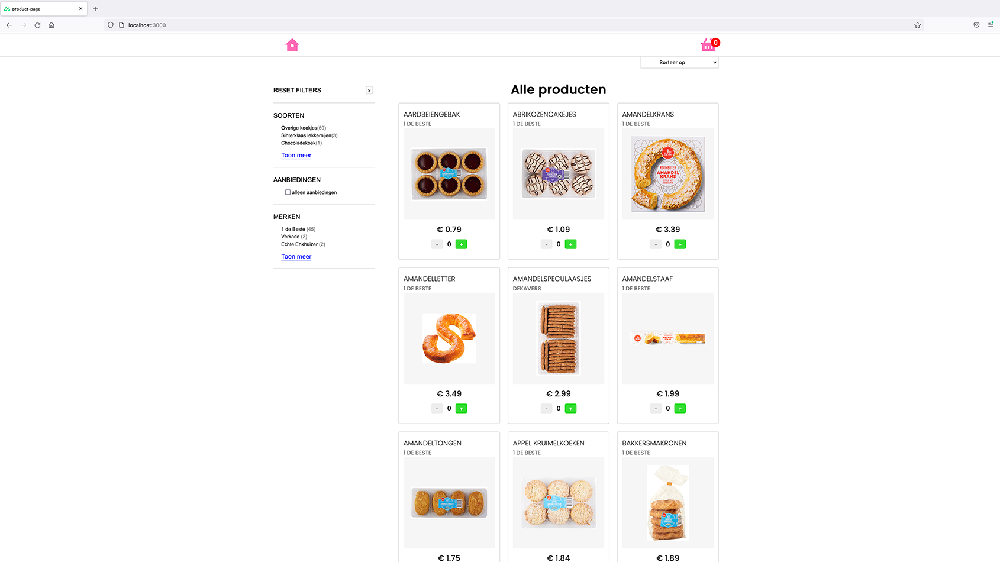

# Nuxtjs Shop met VUEX


[Bekijk hier de live-versie](https://nuxt-product-page.netlify.app/)



## Inleiding

Dit is een project dat ik heb gemaakt als opdracht voor een sollicitatie bij snakeware. De opdracht was om een product pagina te bouwen die data fetched, producten weergeeft, een winkelwagen, product filters en een detail pagina. Bovendien moest de app worden gemaakt met Vue / Nuxt

Ik heb de requirements opgedeeld in kleinere stukken:

1. Product pagina
2. Shoppingcart
3. Filters
4. Detail pagina

Ik heb geprobeerd om deze stap voor stap “agile” op te leveren met gebruik van feature branches die ik na dat ze klaar waren mergde met een development branch. De “live” wordt gedeployed via Netlify vanaf de main branch.

De app is gemaakt met Nuxt & VUEX, daar had ik nog geen ervaring mee, maar ik vond het een leuke uitdaging om het te leren tijdens het bouwen.

Wat ik heb geleerd tijdens deze opdracht:

- In kleine stapjes werken en opleveren vergt discipline want je moet écht bij deze feature en niet alvast gaan werken aan andere dingen. Daardoor heb je wel snel een werkende versie (alleen de producten laten zien)
- Na een werkende versie even opschonen houdt de boel overzichtelijk.
- Nuxt, Vue & VUEX natuurlijk

Hieronder staat een lijst met Pull Request voor de verschillende versies. Die bevatten een samenvattinkje en screenshots / gifs zodat je het proces kan volgen.

## Inhoudsopgave

1. Opdrachtbeschrijving
2. Gebruikte technologieën
3. Gerealiseerde features met Pull Requests
4. Nog te verbeteren
5. Installatie instructies

## 1. Opdrachtbeschrijving

Maak met behulp van de api url een product overzicht met product kaartjes en filters.

## 2. Gebruikte technologieën

- HTML
- Css
- Vuejs
- Nuxtjs
- VUEX
- Javascript

## 3. Gerealiseerde features met Pull Requests

- [#1 Product page](https://github.com/jodelajo/nuxt-product-page/pull/1)
- [#2 Shoppingcart](https://github.com/jodelajo/nuxt-product-page/pull/2)
- [#3 Filters](https://github.com/jodelajo/nuxt-product-page/pull/3)
- [#4 Detailpage, styling and animations](https://github.com/jodelajo/nuxt-product-page/pull/4)
- [#5 Private API_KEY](https://github.com/jodelajo/nuxt-product-page/pull/10)

## 4. Nog te verbeteren

Als ik meer tijd en meer kennis van Vuejs had, had ik graag nog een aantal zaken willen verbeteren. Het laden van de product pagina duurt te lang en de code kan behoorlijk worden opgeschoond en opgeknipt.

Nieuwe features:

- pagination
- beter importeren van fonts
- geautomatiseerde testen
- filters in de url, zoals:
  https://www.coolblue.nl/laptops/apple-macbook/apple-macbook-air/coolblues-keuze/aanbevolen-voor-gebruik-macbook:fotobewerking

## 5. Installatie instructies

#### Kloon en installeer deze repository

```bash
$ git clone https://github.com/jodelajo/nuxt-product-page.git
```

#### Build Setup

```bash
# install dependencies
npm install

# serve with hot reload at localhost:3000
$ npm run dev

# build for production and launch server
npm run build
npm start

# generate static project
npm run generate
```

Configureer de API Key
Kopieer het env.dist bestand

```
cp ...env.dist ..env
```

Open het .env bestand en plaats na "NUXT_ENV_API_KEY" je eigen API key.

```
NUXT_ENV_API_KEY=
```

Check hier de gedetailleerde documentatie op de website van [Nuxt](https://nuxtjs.org).
